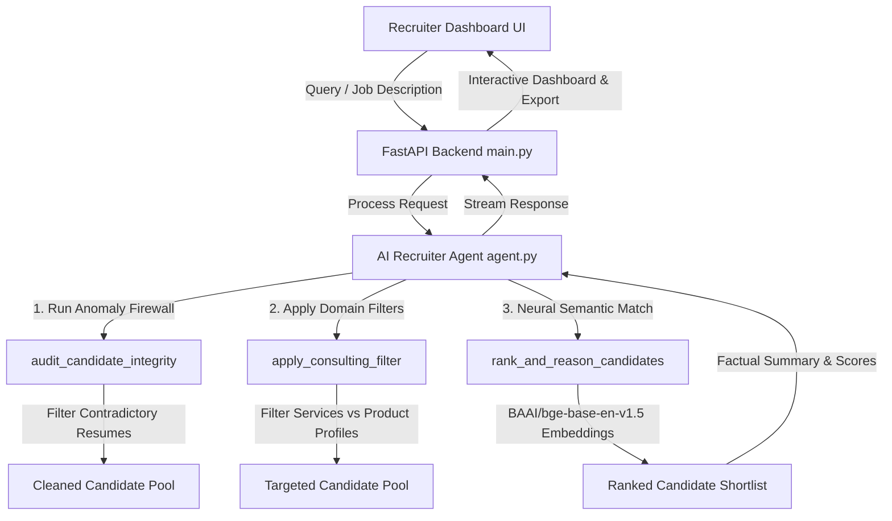

# RecruitShield AI: Autonomous Recruiter Co-Pilot

> 🏆 **Built for First Commit Hackathon 2026**

RecruitShield AI is an intelligent candidate discovery and integrity auditing platform designed to streamline high-judgment resume screening and eliminate fraud. By pairing a custom 5-Point Anomaly Firewall scoring pipeline with neural semantic embeddings (`BAAI/bge-base-en-v1.5`) and an autonomous AI agent, RecruitShield AI empowers recruiters to find true top talent with factual, explainable reasoning.

---

## 🌐 Live Production Deployments
* **🚀 Live Recruiter Dashboard (Vercel)**: [`https://beginner-s-paradise-recruitshield.vercel.app`](https://beginner-s-paradise-recruitshield.vercel.app)
* **⚙️ Live Backend API (Render)**: [`https://beginner-s-paradise-recruitshield.onrender.com`](https://beginner-s-paradise-recruitshield.onrender.com)
* **📖 Interactive API Docs (Swagger)**: [`https://beginner-s-paradise-recruitshield.onrender.com/docs`](https://beginner-s-paradise-recruitshield.onrender.com/docs)
* **🟢 API Health Check**: [`https://beginner-s-paradise-recruitshield.onrender.com/health`](https://beginner-s-paradise-recruitshield.onrender.com/health)

---

## 🤖 AI & Tooling Disclosure

In compliance with the **First Commit Hackathon** rules on transparency:
* **AI Assistance**: Code architecture, routine boilerplates, and refactoring were developed with pair-programming support from Antigravity IDE & Gemini AI models.
* **Original Work**: All algorithms (5-point anomaly checks, hybrid cosine similarity scoring, JSON profile parsing, and ranker logic) were designed, integrated, and verified by our team.

---

## 🏗️ System Architecture

Below is the workflow of how RecruitShield AI processes candidate databases, runs integrity checks, and generates shortlist rankings:



---

## ✨ Key Features

1. **5-Point Anomaly Firewall**: Automatically detects and flags resume inconsistencies (founding year mismatches, inflated experience durations, zero-month expert claims, and post-inactivity signup dates).
2. **Hybrid Neural Matching (`BAAI/bge-base-en-v1.5`)**: Leverages 768-dimensional sentence transformer embeddings for precise semantic matching between job requirements and candidate profiles.
3. **Factual Recruiter Reasoning**: Generates zero-hallucination shortlist rationale based strictly on candidate facts and verified experience metrics.
4. **Offline Embedding Pipeline (`embed_candidates.py`)**: Pre-computes vector representations for thousands of profiles to enable instant vector search during live recruiting sessions.
5. **Modern FastAPI Backend**: High-performance Python backend with built-in CORS, health checks, candidate uploads, and shortlist export features.

---

## 📂 Project Structure

```
.
├── README.md                 # Project documentation & hackathon details
├── requirements.txt          # Python dependencies
├── backend/
│   ├── main.py               # FastAPI application server & REST endpoints
│   ├── agent.py              # Autonomous AI agent logic & tool orchestration
│   ├── ranker.py             # Anomaly firewall & neural semantic scoring engine
│   ├── rank.py               # Candidate ranking utility functions
│   ├── embed_candidates.py   # Offline embedding generator script
│   └── sample_candidates.jsonl # Bundled demo candidate dataset
```

---

## 🚀 Getting Started

### 1. Prerequisites
- Python 3.9+ installed
- `pip` package manager

### 2. Backend Setup
1. Clone the repository:
   ```bash
   git clone https://github.com/Parth-kulkarni300/Beginner-s-Paradise-recruit.git
   cd Beginner-s-Paradise-recruit
   ```

2. Create and activate a virtual environment:
   ```bash
   python -m venv venv
   source venv/bin/activate        # macOS / Linux
   # .\venv\Scripts\activate       # Windows PowerShell
   ```

3. Install requirements:
   ```bash
   pip install -r requirements.txt
   ```

4. Run the FastAPI development server:
   ```bash
   uvicorn backend.main:app --port 8000 --reload
   ```

5. Open your browser and visit:
   - API Docs: `http://localhost:8000/docs`
   - Health Check: `http://localhost:8000/health`

### 3. (Optional) Generate Pre-computed Embeddings
To generate offline vector embeddings for custom candidate datasets:
```bash
python backend/embed_candidates.py --candidates backend/sample_candidates.jsonl
```

---

## 📜 License

This project is open-source under the MIT License.
